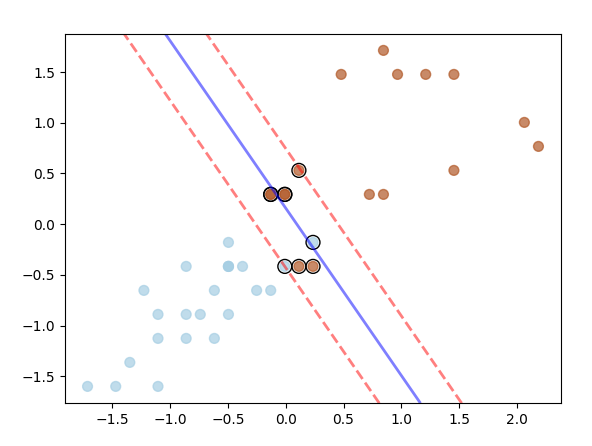

# Machine Learning

# Assignment #4 Support Vector Machines

##### 

| Submitted by:            | Sec. | B.N. |
| ------------------------ | ---- | ---- |
| Alaa Allah Essam Abdrabo | 1    | 13   |

* # This assignment is composed of 2 Problems.

* # Part1 :

  * # The Difference between the dataset using  (without normalization) and those using(normalization):

    * ### 3 types of normalization were tried in this code 

    1. Using built in function that scales  values in the range [0, 1]:

    

    * That results in :

    

    2. scales values to have mean 0 and standard deviation 1:

    

    * That results in :

    

    3. normalization implementation from scratch based on min & max of train and normalize test data with same min & max of train :

    

    * That results in :

    

    # The averaged accuracy over the ten trails:

    ### 3 types of normalization were tried in this code 

    ## 1. Using built in function that scales  values in the range [0, 1]:

    

    ## 2. scales values to have mean 0 and standard deviation 1:

    

    ## 3. normalization implementation from scratch based on min & max of train and normalize test data with same min & max of train :

    

    # The difference in the averaged accuracy of (normalized) and (not-normalized)

    ## we notice that the average accuracy in case of using normalization is higher than without normalization

    ## 4. preprocessing steps to the data

    ### No preprocessing was needed for the given data except for normalization as the data 

    * had no missing values
    * no text as all data points are numeric

    ### before normalization 

    

    ## after normaliztion the range of each feature is between [0,1]

    

* # Part2 :
 * ## Implement, from scratch, linear SVM model using Gradient descent as an optimization function

 * ## Required functions

    ## 1.parameters used in this algorithm

    * C : is the hyperparameter "Regularization Constant" that determines to what extent the soft margine would be(15.0)
    * B : is the beta in hyperplane equation [h(x)=B1*X1+B2*X2+....+b] has number of values according to number of features
    * b : is the bias in previous equation
    * Learning rate: 0.001
    * number of iterations: 500

    

    ## 2.Fit function 
    

    ## 3. predict function
    

    * # Loading Data
    ## - data was loaded from seaborn package 
    ## - For binary classification only two classes of data were used so, the last 100 points were extracted being of 2 classes 
    ## - In this algorithm equations were designed according to classes with codes of -1 & 1 then all 0 class were just encoded to be -1 and the other class was already of code 1 
    ## -"species" column was dropped as it had classes written in text
    ## - This data has 4 features but only 2 were taken as mentioned in the statement to be easily drawn in 2d graph
    ## - preprocessing step was applied to the data which is standardization
    ## - Splitting data into training and testing data with 60% training

    

    # Accuracy 

    ## Accuracy from implemented algorithm & sklearn

    

# Plotting the 2 features
## 1. using train data

## 1. using train data

